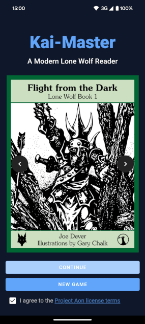

# Kai-Master

  

Kai-Master is a modern, mobile-first Progressive Web Application (PWA) that brings the classic Lone Wolf gamebook series to life. Experience Joe Dever's epic adventures in a sleek, intuitive interface designed for both newcomers and long-time fans of the series.

  

## 🌟 Features

- 📚 Play Kai, Magnakai and Grand Master Lone Wolf gamebooks
- 📱 Mobile-first design for on-the-go play
- 🏠 Offline support for uninterrupted adventures
- 🎲 Interactive combat system
- 🗺️ Easy navigation through sections
- 📲 Installable as a PWA for a native app-like experience

## 🚀 Getting Started

### Play Now

You can start your adventure right away by visiting:

[https://kai-master.corbel.dev](https://kai-master.corbel.dev)

No installation required! Just open the link in your favorite web browser and begin your journey as a Kai Lord.

### Install as a PWA

Kai-Master is a Progressive Web App, which means you can install it on your device for a native app-like experience. Here's how:

#### On Android:

1. Open [https://kai-master.corbel.dev](https://kai-master.corbel.dev) in Chrome
2. Tap the menu icon (3 dots) in the top right corner
3. Tap "Add to Home screen"
4. Follow the on-screen instructions

#### On iOS:

1. Open [https://kai-master.corbel.dev](https://kai-master.corbel.dev) in Safari
2. Tap the Share button at the bottom of the screen
3. Scroll down and tap "Add to Home Screen"
4. Tap "Add" in the top right corner

Once installed, you can launch Kai-Master from your home screen or app drawer, just like any other app!

## 📖 How to Play

1. Visit [https://kai-master.corbel.dev](https://kai-master.corbel.dev) in your web browser or open the installed PWA.
2. Choose a Lone Wolf book from the available titles.
3. Read through the introduction and game rules.
4. Set up your character by selecting Kai disciplines and equipment.
5. Navigate through the story by making choices and turning to new sections.
6. Engage in combat using the interactive combat system.
7. Manage your inventory and stats in the Action Chart.
8. Try to complete your mission and become a true Kai Master!

## 🤝 Contributing

We welcome contributions from the community! If you'd like to contribute to Kai-Master, please follow these steps:

1. Fork the repository
2. Create a new branch (`git checkout -b feature/amazing-feature`)
3. Commit your changes (`git commit -m 'Add some amazing feature'`)
4. Push to the branch (`git push origin feature/amazing-feature`)
5. Open a Pull Request

Please read our [CONTRIBUTING.md](CONTRIBUTING.md) for details on our code of conduct and the process for submitting pull requests.

## 📄 License

This project is licensed under the MIT License - see the [LICENSE](LICENSE) file for details.

## 🙏 Acknowledgments

- Joe Dever, for creating the amazing Lone Wolf series
- Gary Chalk, for the original illustrations
- [Project Aon](https://www.projectaon.org/), for their efforts in preserving and distributing the Lone Wolf books
- All the fans and contributors who have kept the spirit of Lone Wolf alive

## 📞 Contact

If you have any questions, suggestions, or just want to say hello, feel free to reach out:

- Project Link: [https://github.com/pcorbel/kai-master](https://github.com/pcorbel/kai-master)

---

May the power of the Kai and the wisdom of the ancients guide you on your journey, brave reader!
